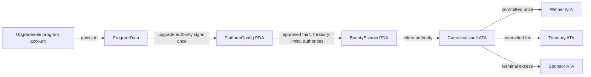
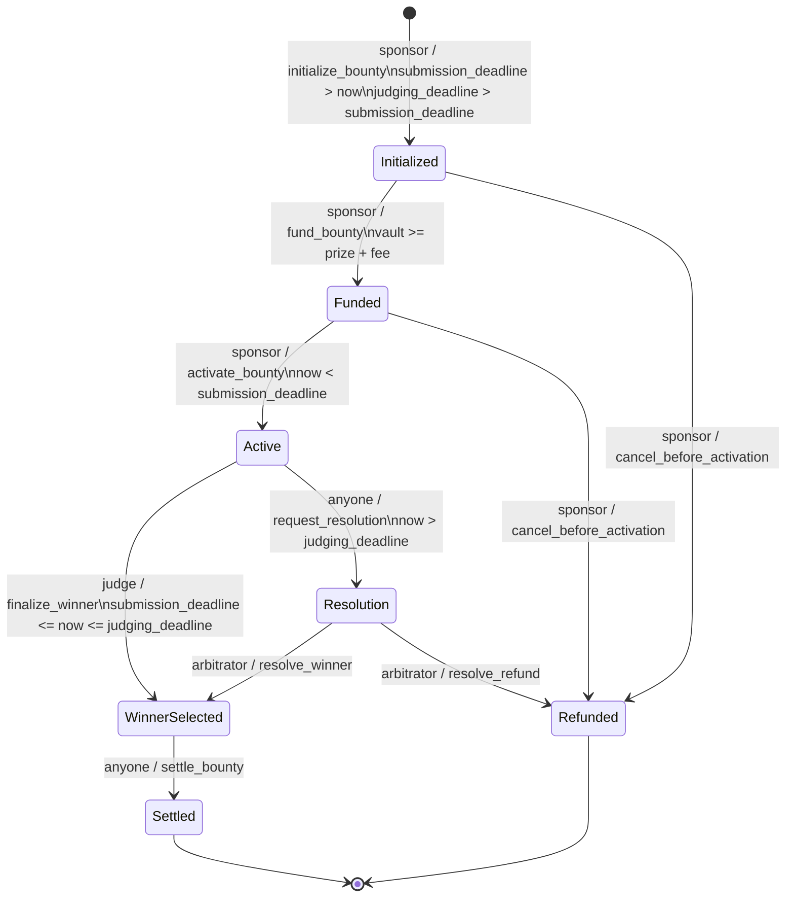
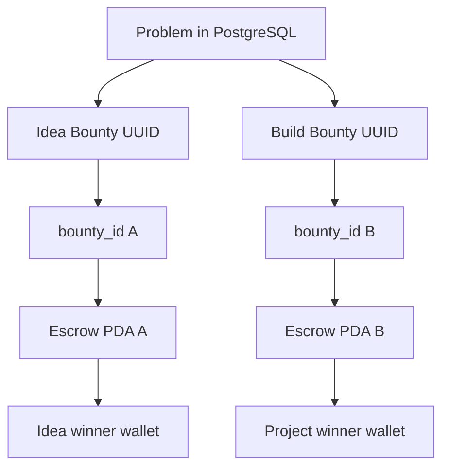

# Bounty Escrow V1 State Machine

This document specifies the financial state machine implemented by
`programs/bounty-escrow`. Product states such as draft, submission review, Idea,
Build, and Project remain off-chain.

## Account architecture



- `PlatformConfig = PDA(["platform"], program_id)`.
- `BountyEscrow = PDA(["bounty", bounty_id_32], program_id)`.
- `vault = ATA(owner = BountyEscrow PDA, mint = approved legacy SPL mint)`.
- `bounty_id_32 = SHA-256(UTF8("GIMME_IDEA_BOUNTY_V1") || UUID_BYTES)`.
- Each database bounty UUID has one independent escrow. The contract has no
  Idea/Build discriminator and no parent-bounty relationship.

## State graph



`Settled` and `Refunded` are exclusive terminal states. Solana transaction
atomicity means state writes, token transfers, and vault closure all commit or
all roll back.

## Transition and pause rules

| From               | Instruction                | Actor                                 | Time condition                        | To             | Blocked while paused |
| ------------------ | -------------------------- | ------------------------------------- | ------------------------------------- | -------------- | -------------------- |
| none               | `initialize_platform`      | current upgrade authority             | platform absent                       | platform ready | n/a                  |
| none               | `initialize_bounty`        | sponsor                               | submission deadline in future         | Initialized    | yes                  |
| Initialized        | `fund_bounty`              | sponsor                               | none                                  | Funded         | yes                  |
| Funded             | `activate_bounty`          | sponsor                               | before submission deadline            | Active         | yes                  |
| Active             | `finalize_winner`          | judge                                 | submission closed, judging still open | WinnerSelected | yes                  |
| WinnerSelected     | `settle_bounty`            | anyone/relayer                        | none                                  | Settled        | no                   |
| Initialized/Funded | `cancel_before_activation` | sponsor                               | before activation by state            | Refunded       | no                   |
| Active             | `request_resolution`       | anyone                                | strictly after judging deadline       | Resolution     | no                   |
| Resolution         | `resolve_winner`           | arbitrator                            | none                                  | WinnerSelected | no                   |
| Resolution         | `resolve_refund`           | arbitrator; any relayer pays ATA rent | none                                  | Refunded       | no                   |

Pause is an incident-containment switch, not a custody power. It blocks new
commitments and normal judging, while preserving every exit or recovery path for
already committed funds.

## Authority matrix

| Action                    | Deployment Initializer |        Sponsor | Judge | Arbitrator | Pause Authority | Relayer/Anyone |
| ------------------------- | ---------------------: | -------------: | ----: | ---------: | --------------: | -------------: |
| Initialize Platform       |                    YES |             NO |    NO |         NO |              NO |             NO |
| Initialize Bounty         |                     NO |            YES |    NO |         NO |              NO |             NO |
| Fund                      |                     NO |            YES |    NO |         NO |              NO |             NO |
| Activate                  |                     NO |            YES |    NO |         NO |              NO |             NO |
| Finalize Winner           |                     NO |             NO |   YES |         NO |              NO |             NO |
| Settle                    |                     NO | optional payer |    NO |         NO |              NO |            YES |
| Cancel Pre-Activation     |                     NO |            YES |    NO |         NO |              NO |             NO |
| Request Resolution        |                     NO |            YES |   YES |        YES |             YES |            YES |
| Resolve Winner            |                     NO |             NO |    NO |        YES |              NO |             NO |
| Resolve Refund            |                     NO |             NO |    NO |        YES |              NO | optional payer |
| Pause                     |                     NO |             NO |    NO |         NO |             YES |             NO |
| Arbitrary Escrow Withdraw |                     NO |             NO |    NO |         NO |              NO |             NO |

The stored `admin` is immutable initialization provenance only. It has no
post-initialization instruction authority.

## Money flow and excess policy

```text
COMPANY FUNDING WALLET
        |
        | missing amount up to (prize + fee)
        v
BOUNTY PDA VAULT
        |-- exact committed prize --> deterministic winner ATA
        |-- exact committed fee ----> deterministic treasury ATA
        `-- all terminal excess ----> deterministic sponsor ATA
```

The commitment is always `required_total = prize_pool + platform_fee`, not the
raw vault balance. Direct approved-mint donations do not change terms, prize,
fee, winner, or state. A balance at or above `required_total` can become Funded.
Excess cannot be withdrawn while Active. At settlement or refund all excess is
sent to the sponsor ATA and the vault is closed; missing ATAs can be created by
the transaction payer without destination discretion.

Refund paths are:

```text
Initialized/Funded -- sponsor cancel --> all vault tokens --> sponsor ATA
Resolution -------- arbitrator -------> all vault tokens --> sponsor ATA
```

## Two-stage product mapping



The backend enforces that the Build bounty is created only after the Idea
bounty result. The program only observes two unrelated 32-byte identifiers.

## Threat model and invariants

| Threat                                        | Contract control                                                                                       |
| --------------------------------------------- | ------------------------------------------------------------------------------------------------------ |
| Platform initialization front-run             | program and ProgramData are loader-validated; current upgrade authority must sign                      |
| Fake/stablecoin-like mint                     | Platform stores one approved legacy SPL Token mint; all bounty and ATA constraints bind to it          |
| Direct vault donation / pre-created ATA       | vault initialization is idempotent; funding uses `>= required_total`; excess has a terminal-only route |
| Sponsor disappears or closes ATA              | settlement is permissionless and recreates deterministic winner, treasury, and sponsor ATAs as needed  |
| Sponsor cancels after builders work           | cancellation accepts only Initialized or Funded                                                        |
| Arbitrary destination substitution            | winner, treasury, sponsor, mint, PDA, and ATA derivations are all constrained                          |
| Double payout/refund or cross-terminal replay | strict state transitions plus atomic terminal operations                                               |
| Pause used to freeze money                    | settlement, cancellation, resolution request, and arbitration remain callable while paused             |
| Admin/treasury drain                          | no generic withdrawal or pull instruction exists                                                       |
| Arithmetic overflow/overpayment               | checked `u64` total and `u128` fee calculation; transfers use committed values                         |

## Test matrix

The local Anchor suite covers initialization authority and front-running,
parameter validation, distinct bounty IDs/PDAs, pre-created and overfunded vaults,
wrong sponsor/mint/program/PDA/vault, funding/activation replay, deadline
boundaries, active cancellation protection, judge/arbitrator authorization,
missing destination ATA creation, sponsor ATA closure, exact prize/fee/excess
flows, pause liveness, resolution winner/refund, and terminal replay failures.
Rust unit/property loops cover checked totals, fee bounds, and committed-outflow
invariants across boundary values.
