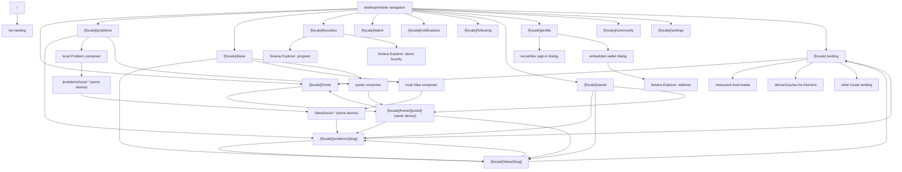
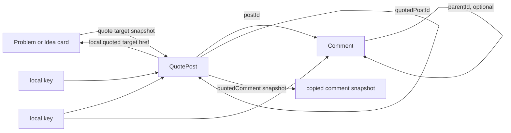
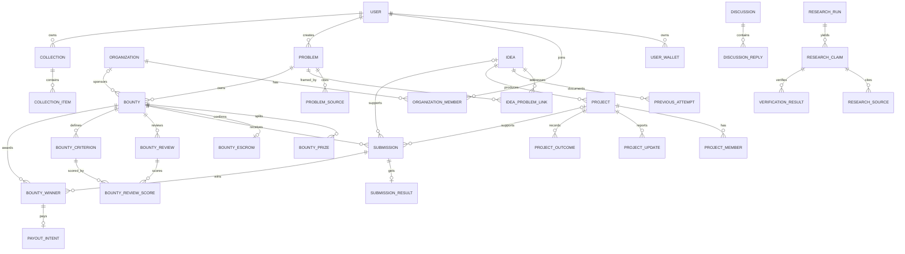
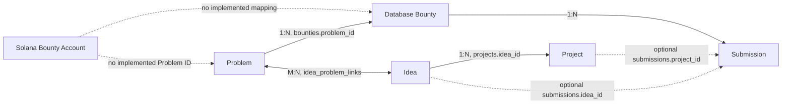

# Gimme Idea — Current Implemented State

> Audit date: 2026-09-04 (Asia/Ho_Chi_Minh)  
> Branch/commit: `rebuild-gimme-idea-v2` at `49195d6`  
> Scope: implemented code and live local/Devnet state only. This is not a roadmap.

## 1. Executive Summary

Gimme Idea currently has a working bilingual (`/en`, `/vi`) foundation composed of:

- a cinematic editorial landing page;
- an X-like product frame with a desktop 20/55/25 sidebar/feed/discovery layout and a mobile header/dock;
- read-only canonical Problem and Idea pages backed by Fastify and local Postgres/Supabase;
- browser-local creation of Problem and Idea posts, including media;
- browser-local quote posts, threads, comments, replies, likes, bookmarks, shares and view counts;
- optional Privy social sign-in with an automatically provisioned embedded Solana wallet;
- a real development test account backed by a persistent server-generated Solana Devnet keypair;
- a wallet panel that reads real Devnet SOL and USDC balances;
- a read-only Bounties page that decodes a real settled bounty account directly from Solana Devnet;
- an Anchor bounty escrow program deployed to Devnet and exercised through a full smoke-test lifecycle.

The product has two disconnected state planes. Canonical Problem/Idea content comes from Postgres through the API. All user-created posts and social actions currently remain in `localStorage`/IndexedDB and never reach the API or database. The on-chain demo bounty is a third independent state plane: it is real Devnet state, but it is not reconciled with the database bounty rows or canonical Problems.

Major incomplete or disconnected areas are production authentication, server-side authorization, persistent social data, upload storage, Project routes, bounty creation/funding/submission/judging UI, withdrawals, transaction indexing, AI execution, Redis queues, and database/on-chain reconciliation. Several pages intentionally render empty states. Canonical detail pages do not expose social actions even though feed cards do.

### Detected stack

| Area             | Current implementation                                                                                    |
| ---------------- | --------------------------------------------------------------------------------------------------------- |
| Runtime/tooling  | Node `22.23.2` line required; pnpm `10.18.3`; Turborepo `2.10.12`; TypeScript `5.9.3`                     |
| Frontend         | Next.js `16.3.3` App Router, React `19.2.8`, SSR/server components plus client components                 |
| Styling/UI       | Hand-written CSS; Lucide React `1.38.0`; tiny internal `@gimme-idea/ui`; no Tailwind                      |
| Typography       | Geist + Geist Mono through `next/font`; Inter/system fallbacks                                            |
| Motion/3D        | Anime.js `4.5.0`, Three.js `0.185.1`, React Three Fiber `9.7.0`                                           |
| Backend          | Fastify `5.12.1`, `@fastify/cors` `11.3.0`, modular-boundary constants but two actual read repositories   |
| Database         | Local Supabase/Postgres; Drizzle ORM schema `0.45.2`; timestamped SQL migrations and seed                 |
| Authentication   | Privy React Auth `3.39.0` when configured; otherwise development mock account; browser-local app session  |
| Blockchain       | Solana Web3.js `1.98.4`; Anchor `0.31.1`; SPL Token/Token-2022-compatible escrow program on Devnet        |
| AI               | No provider, prompts, queue or execution. Only schemas, status fields and disabled worker job names exist |
| State management | React state/context plus `localStorage` and IndexedDB; no Redux/Zustand/Query library                     |

### Audit-time runtime status

- Web responded `200` at `http://127.0.0.1:10000/en`.
- API responded healthy/ready at ports `3001`; database was `ok`, AI/Redis/Solana were reported `not_configured` by the API.
- Worker responded healthy/ready at port `3002`; its registry was present while Redis and AI remained `not_configured`.
- Local database counts: 3 users, 2 organizations, 5 Problems, 10 Ideas, 3 Projects, 2 bounties, 3 submissions, 10 discussions, 0 likes, 0 follows and 0 research runs.
- `pnpm lint`, `pnpm typecheck` and unit tests passed. `pnpm format:check` failed only on the pre-existing `.superstack/build-context.md` and `codex-work.md`; this audit did not modify them.
- Each service has a Dockerfile, but no hosting manifest, public frontend/API deployment or linked remote Supabase project was detected in this checkout. Runtime verification therefore covers the local services plus Solana Devnet, not a public staging environment.

## 2. Current Repository Structure

```text
.
├── apps/
│   ├── web/                    # Next.js UI, routes, auth bridge and browser-local social layer
│   ├── api/                    # Fastify HTTP API and development account provider
│   ├── worker/                 # Fastify health lifecycle plus disabled typed job registry
│   └── */Dockerfile            # Per-service production container builds
├── packages/
│   ├── auth/                   # Placeholder package; not the active web auth implementation
│   ├── config/                 # Zod environment parsing for API and worker
│   ├── contracts/              # Shared Zod API DTOs and health/error contracts
│   ├── db/                     # Drizzle schema, Postgres repository and seed verifier
│   ├── solana/                 # Devnet bounty account decoder/read client
│   ├── ui/                     # Eyebrow and StatusPill primitives
│   └── utils/                  # Shared utility package foundation
├── programs/
│   └── bounty-escrow/          # Anchor/Rust bounty escrow program
├── supabase/
│   ├── migrations/             # Identity through audit schema migrations
│   └── seed.sql                # Reproducible development fixtures
├── scripts/
│   └── devnet-bounty-smoke.ts  # Creates/funds/activates/finalizes/settles a real test bounty
├── tests/
│   ├── anchor/                 # Local-validator program lifecycle and negative-path tests
│   └── e2e/                    # Playwright product/accessibility/responsive tests
├── brand-assets/               # Original retained logo and brand notes
├── docs/                       # Product/architecture/design/contract documentation
├── .github/workflows/          # Deterministic/verifiable program build workflow
├── Anchor.toml                 # Anchor localnet/devnet program configuration
├── Cargo.toml                  # Rust workspace/release profile
├── package.json                # Monorepo scripts and pinned tools
├── playwright.config.ts        # 360/768/1280 test projects
└── turbo.json                  # Build/lint/typecheck/test pipeline
```

Generated outputs such as `.next`, `dist`, `target`, `.turbo`, reports and `node_modules` are deliberately omitted.

## 3. Current Route Map

Every route under `[locale]` exists in both English and Vietnamese. `/` redirects to English. Creator-authored canonical content is not translated; only surrounding UI copy changes locale.

| Route                           | Page/components                                                  | Implemented?                                | Data source                                                                         | Main actions and destinations                                                                                                                                                                                   |
| ------------------------------- | ---------------------------------------------------------------- | ------------------------------------------- | ----------------------------------------------------------------------------------- | --------------------------------------------------------------------------------------------------------------------------------------------------------------------------------------------------------------- |
| `/`                             | Root redirect                                                    | Yes                                         | Static                                                                              | Redirects to `/en`                                                                                                                                                                                              |
| `/[locale]`                     | Landing; `BrainLoader`, `BrainScene`, `Narrative`                | Working                                     | Static localized copy + procedural WebGL                                            | Open App → `/[locale]/home`; Explore Problem → restaurant Problem; Inspect Idea → Demand Pulse Idea; language switch → other locale landing; scroll cue → `#sequence`                                           |
| `/[locale]/home`                | Quote-only feed; `HomeQuoteFeed`, `QuotePostCard`                | Partial/local                               | `localStorage`                                                                      | Empty state links to Problems/Ideas. Existing quote cards open local threads and expose comment, re-quote, view, like, save and share actions                                                                   |
| `/[locale]/home/[postId]`       | Local quote thread; `QuoteThread`                                | Partial/local                               | `localStorage`, data-URL media                                                      | Back → Home; reply/comment, nested reply, comment like, quote-comment, post like/save/share. Unknown/missing device-local ID shows an empty state, not a server 404                                             |
| `/[locale]/problems`            | Problem feed; `KnowledgeFeed`, `KnowledgePost`                   | Partial                                     | Two hardcoded slugs fetched from real API + browser-local posts                     | Card → Problem detail; save/share/like/quote require sign-in; global Post opens Problem composer directly on this route                                                                                         |
| `/[locale]/problems/[slug]`     | Canonical `ProblemPage`, or `LocalKnowledgeDetail` for `local-*` | Canonical read works; local variant partial | API/Postgres or browser storage                                                     | Canonical: Home breadcrumb and related Idea cards. Section-index anchors work. No canonical Like/Save/Follow/Discuss/Share/Propose/View Bounty/Submit CTA. Local: back to Problems and local related-Idea links |
| `/[locale]/ideas`               | Idea feed; `KnowledgeFeed`, `KnowledgePost`                      | Partial                                     | One hardcoded slug fetched from real API + browser-local posts                      | Card → Idea detail; save/share/like/quote require sign-in; global Post opens Idea composer directly                                                                                                             |
| `/[locale]/ideas/[slug]`        | Canonical `IdeaPage`, or `LocalKnowledgeDetail` for `local-*`    | Canonical read works; local variant partial | API/Postgres or browser storage                                                     | Canonical Primary Problem card → Problem detail; previous-attempt source → external URL; section anchors. Project is display-only. No Discuss/Build/Save/Follow/Bounty CTA                                      |
| `/[locale]/bounties`            | `BountiesPage` on-chain dashboard                                | Read-only working                           | Direct Solana Devnet RPC from server component                                      | Explorer links for program and one hardcoded demo bounty; retry reload on RPC failure. No Submit/View Problem/Fund/Connect Wallet/Review action                                                                 |
| `/[locale]/notifications`       | Static empty state                                               | Shell only                                  | Hardcoded empty copy                                                                | No action; sidebar badge is hardcoded `0`                                                                                                                                                                       |
| `/[locale]/following`           | Static empty state                                               | Shell only                                  | Hardcoded empty copy                                                                | No action; no follow graph is queried                                                                                                                                                                           |
| `/[locale]/saved?tab=bookmarks` | `SavedLibrary` bookmarks tab                                     | Partial/local                               | Browser social keys + 3 specifically fetched canonical objects + local posts/quotes | Tab switch; saved cards retain their normal detail/social actions                                                                                                                                               |
| `/[locale]/saved?tab=likes`     | `SavedLibrary` likes tab                                         | Partial/local                               | Same as above                                                                       | Tab switch; liked cards open their detail/thread                                                                                                                                                                |
| `/[locale]/profile`             | `ProfileSession`                                                 | Partial                                     | Auth context/local session + direct Devnet RPC in wallet dialog                     | Guest Sign In opens auth dialog. Signed-in Open Wallet opens balance dialog; Log out clears session/Privy state                                                                                                 |
| `/[locale]/talent`              | Static empty state                                               | Shell only                                  | Hardcoded empty copy                                                                | No action                                                                                                                                                                                                       |
| `/[locale]/community`           | Static empty state                                               | Shell only                                  | Hardcoded empty copy                                                                | No discussion records are loaded despite 10 seeded database rows                                                                                                                                                |
| `/[locale]/settings`            | Language/appearance settings                                     | Partial                                     | Static/device route                                                                 | Language navigates to other locale settings; Appearance button is visibly disabled                                                                                                                              |
| `/devnet-admin`                 | `DevnetProgramAdmin`                                             | Guarded utility                             | Direct Solana Devnet RPC + injected Phantom/Solflare                                | Connect exact upgrade-authority wallet, close one hardcoded stale buffer, or sign a prepared-buffer program upgrade. It is not in product navigation and returns 404 in production unless explicitly enabled    |

### Product-frame actions available on nearly every localized app route

- Left sidebar: Home, Ideas, Problems, Bounties, Talent, Notifications, Following, Saved, Profile.
- At `max-width: 1180px` or `max-height: 780px`, Bounties, Talent and Saved move into More. More always also contains Landing, Community and Settings.
- Post requires auth. On Ideas/Problems it opens that type directly; elsewhere it opens a two-option Idea/Problem menu.
- Signed-out account area is a purple Sign In button. Signed-in account area opens Switch accounts (reopens the auth dialog) and Log out; the wallet balance opens `WalletDialog`.
- Right-rail search only filters one or two hardcoded suggestions and never queries an API. Form submission is prevented.
- Mobile uses a fixed header, search/menu sheets and a bottom dock for Home, Ideas, Post, Problems and Profile.

### Current Post composers (browser-local)

- **Problem required:** Title (120 chars), 1-line description (180), Problem (1,400), Who has this problem? (700), Why does it matter? (700).
- **Problem optional:** Region/Market, Industry, Current workaround, Existing solutions, Desired outcome, Evidence/source, Constraints, Known data (700 chars each), bounty amount with up to 6 USDC decimals, hiring flag and media.
- **Idea required:** Primary Problem (choose one of two hardcoded Problems or type a new title), Title (120), 1-line description (180), Opportunity (1,000), Solution (1,000).
- **Idea optional:** How it works, Target segment, Why now, Business model, Go-to-market, Technical approach, Competitors, Risks, Previous Attempts, Dependencies, Success metrics, GitHub/demo/deck links (700 chars each) and media.
- **Media:** at most 10 images at 5 MiB each plus one video at 25 MiB. Publish writes metadata to `localStorage`, blobs to IndexedDB and navigates to a `local-*` detail route. No API request occurs.

## 4. Navigation Graph



Notably absent from this graph are Project pages, Submission pages, canonical Discussion pages, organization pages and a link between the on-chain bounty view and any canonical Problem.

## 5. Problem Page — Current Implementation

### Displayed information

Canonical `apps/web/src/app/[locale]/problems/[slug]/page.tsx` displays:

1. breadcrumb back to localized landing;
2. severity, title and one-line summary;
3. research status and provenance origin pills;
4. an in-page chapter index;
5. Problem description;
6. affected groups (`Who has this problem?`);
7. evidence (`Why does it matter?`);
8. optional first eligible database bounty with status, raw-unit-converted amount and a `DEV FIXTURE` label;
9. up to six related published Ideas;
10. provenance origin, human-review state, research timestamp and source links.

The repository query is `findProblem` in `packages/db/src/repository.ts`. It queries the canonical row, sources, Idea links and only the first bounty whose status is `unfunded` or `mock_funded`.

### Actions

| Action                                 | Destination/handler                                                               | State                                                 |
| -------------------------------------- | --------------------------------------------------------------------------------- | ----------------------------------------------------- |
| Home breadcrumb                        | `/[locale]` via Next `Link`                                                       | Working                                               |
| Chapter index                          | `#problem`, `#who`, `#why`, optional `#opportunity`, `#related-ideas`, `#sources` | Working in-page navigation                            |
| Related Idea                           | `/[locale]/ideas/[slug]`                                                          | Working, API-backed                                   |
| Provenance source                      | External source URL                                                               | Working link; source correctness is fixture-dependent |
| Like / Save / Follow / Discuss / Share | Not rendered on canonical page                                                    | Not implemented here                                  |
| Propose Idea                           | Not rendered                                                                      | Not implemented                                       |
| View Bounty                            | Bounty panel has no link                                                          | Missing/disconnected                                  |
| Submit Solution                        | Not rendered                                                                      | Not implemented                                       |

Feed-card Like/Save/Share/Quote actions exist on `/problems`, but those are separate client-side controls and are not rendered on the canonical page.

### Relationships

- **Ideas:** real many-to-many database relation through `idea_problem_links`; the page returns primary and secondary relationships together and displays up to six.
- **Bounties:** real one-to-many relation through `bounties.problem_id`; the DTO deliberately exposes at most one unfunded/mock-funded row.
- **Projects:** not queried. A Project is indirectly related through an Idea, but the Problem DTO/page does not know it.
- **Discussions:** not queried. Database discussion rows use `(entity_type, entity_id)`, but no canonical Discussion API/UI consumes them.

The `local-*` Problem page is a separate browser-only model. It shows required composer fields, optional details/media, local bounty/hiring flags and local Ideas whose `primaryProblemSlug` matches. It does not create a database row.

## 6. Idea Page — Current Implementation

Canonical `apps/web/src/app/[locale]/ideas/[slug]/page.tsx` displays:

1. breadcrumb back to localized landing;
2. title, one-line summary, research status and provenance origin;
3. a prominent Primary Problem card linking to its canonical Problem;
4. Opportunity/thesis;
5. Solution;
6. target-user tags;
7. optional first Project summary (`name`, `stage`) without a link;
8. Previous Attempts with outcome, description, lesson and optional external source;
9. provenance inherited from sources attached to the Primary Problem.

`findIdea` reads the real Idea, exactly one Primary Problem, all Previous Attempts, only the earliest non-deleted Project and sources belonging to the Primary Problem.

| Action                                    | Destination/handler                                            | State                                      |
| ----------------------------------------- | -------------------------------------------------------------- | ------------------------------------------ |
| Home breadcrumb                           | `/[locale]`                                                    | Working                                    |
| Primary Problem                           | `/[locale]/problems/[slug]`                                    | Working                                    |
| Chapter index                             | Opportunity/Solution/Audience/Project/Attempts/Sources anchors | Working                                    |
| Previous Attempt source                   | External URL                                                   | Working link; some seeds use `example.com` |
| Project panel                             | No link/handler                                                | Display-only                               |
| Discuss / Build this Idea / Save / Follow | Not rendered on canonical page                                 | Not implemented here                       |
| View Bounty                               | Not rendered; Idea DTO has no bounty                           | Not implemented                            |

Relationship reality:

- Primary Problem is real and required for published Ideas by database trigger.
- Secondary Problem links are allowed by the schema but not returned by the Idea API.
- Project is real in the database, but only a three-field summary of one Project is returned.
- Previous Attempts are real seeded rows.
- Discussions and Bounties are not queried or exposed.

The browser-local Idea page supports the composer fields, optional details/media and a `primaryProblemSlug`. Selecting “create new Problem” inside the Idea composer only stores a slug/title reference; it does not create a corresponding local Problem object, so that generated Problem link can lead to the local missing state.

## 7. Bounty Page — Current Implementation

There is one list/dashboard route and no bounty-detail route. `apps/web/src/app/[locale]/bounties/page.tsx` calls `fetchDevnetBountySnapshot` from `packages/solana/src/index.ts` and decodes a hardcoded/configurable account directly from Devnet.

### Live demo account at audit time

| Field                 | Current value                                                                         |
| --------------------- | ------------------------------------------------------------------------------------- |
| Program               | `BB2bMK8gwrDk3YG3GFECqnwnFigDoxvKDwJZiTXtzCK6`                                        |
| Bounty account        | `Fgu2x9AJkF7183BoQ2c9gXUbN588wBSAinGqoQssMzR`                                         |
| Token                 | Custom Devnet TEST mint `CK2tWF2k3PEAZti7bxZj5jcfCabYGus6TbdFwinNGFyQ`; no real value |
| Sponsor/judge         | `HrsRZ43rXfXJjLtzdyNYAVvNEZc6faQkMJwFhiHnVSUu`                                        |
| Prize / fee / deposit | 10 TEST / 0.25 TEST / 10.25 TEST                                                      |
| State                 | `settled`; winner selected and vault paid/emptied in the smoke test                   |
| Winner                | `HkJv6EPD4na4Nb8byw9t7GfonzVahxksD4m3DAEgBr1h`                                        |
| Problem relation      | None on-chain and none added in this UI                                               |

The page displays program deployment status, state, prize, deposit, fee, sponsor, judge, winner, mint, timestamps and terms hash. It does not display submissions, judging criteria/reviews, a sponsoring organization, database escrow status or a canonical Problem.

| Requested CTA     | Current reality                                         |
| ----------------- | ------------------------------------------------------- |
| Submit            | Absent                                                  |
| View Problem      | Absent; no mapping exists                               |
| Fund              | Absent                                                  |
| Connect Wallet    | Absent on the bounty page                               |
| Review Submission | Absent                                                  |
| Explorer          | Working external links for the program and demo account |

The two seeded database bounties are separate fixtures. One belongs to `restaurant-food-waste` and is `unfunded`; one belongs to `tenant-repair-visibility` and is `mock_funded`. Neither is the Devnet account above.

## 8. Project Page — Current Implementation

No `/projects`, `/projects/[slug]` or equivalent Project route exists.

The database has 3 seeded Projects and tables for members, updates and outcomes. A Project belongs directly to exactly one Idea via `projects.idea_id`; its Problem is only reachable through that Idea's Problem links. The canonical Idea DTO returns one Project's `slug`, `name` and `stage`, but the UI does not link the panel anywhere. Repository URL, website/demo URL, description, creator, team, updates and outcomes are excluded from the DTO.

Therefore GitHub, demo, team, submission links, bounty results and outcomes cannot currently be viewed as a Project page. The seeded `repository_url` values use `github.com/example/...` fixtures.

## 9. Discussion / Social Layer

Two unrelated discussion systems exist:

1. **Database Discussion schema:** `discussions` references an object weakly through `entity_type` + `entity_id`; `discussion_replies` references a Discussion and optionally a parent reply. Ten discussion rows are seeded. No API, page or component reads or writes them.
2. **Browser social prototype:** `QuotePost`, `SocialComment`, bookmark/like arrays and counters are stored under `gimme-idea-social-v2` in `localStorage`. Knowledge-post blobs use IndexedDB `gimme-idea-media-v2`; quote/comment media is a data URL in `localStorage`.

Actual browser relationship:



Problem → Discuss, Idea → Discuss and Project → Discuss do not create/use a database Discussion. A user can quote a Problem/Idea **feed card**, which snapshots title, summary, creator and attachments into a local QuotePost and navigates to a local Home thread. The canonical detail pages expose no Discuss CTA.

Replies use `parentId` and auto-prefix `@username`. The renderer flattens arbitrary parent chains into only depth 0 or 1 visually, preventing unbounded indentation. Markdown support is a small custom renderer for paragraphs/newlines, blockquotes, unordered lists, inline code, bold and `@mentions`; it is not a full CommonMark parser. Comments may include one image/video under 1.8 MB. Likes, counts and reverse links are all local to that browser.

## 10. Current Domain/Data Model

### Core ER diagram



Polymorphic `entity_type`/`entity_id` columns in Discussions, Likes, Follows, provenance, moderation and imports are not foreign keys to Problem/Idea/Project tables. Referential integrity for those targets is not enforced by Postgres.

### Entity inventory

Status means product-operational status, not merely whether a table exists.

| Entity/table                                                        | Status                     | Key fields, PK/FKs and current use                                                                                                                                   |
| ------------------------------------------------------------------- | -------------------------- | -------------------------------------------------------------------------------------------------------------------------------------------------------------------- |
| `users`                                                             | PARTIALLY IMPLEMENTED      | PK `id`; unique `auth_user_id`, username/profile fields. Seeded/read as Problem/Idea creators, but Privy/dev sessions are not synchronized to it                     |
| `user_wallets`                                                      | PARTIALLY IMPLEMENTED      | PK `id`; FK `user_id`; chain/address/primary/verified. No active repository/API uses it                                                                              |
| `organizations`                                                     | PARTIALLY IMPLEMENTED      | PK `id`; slug/name/type/verification; optional `created_by`. Seeded and referenced by bounties; no route/API                                                         |
| `organization_members`                                              | IMPLEMENTED (DB only)      | Composite PK `(organization_id,user_id)`; role/permission level. No authorization code                                                                               |
| `problems`                                                          | IMPLEMENTED read-only      | PK `id`; slug/title/summary/description/groups/evidence/severity/status/research/origin/creator. API/detail/feed read it                                             |
| `problem_sources`                                                   | IMPLEMENTED read-only      | PK `id`; FK `problem_id`; title/URL/publisher/date. Returned as provenance                                                                                           |
| `ideas`                                                             | IMPLEMENTED read-only      | PK `id`; slug/title/summary/thesis/solution/targets/status/research/origin/creator                                                                                   |
| `idea_problem_links`                                                | IMPLEMENTED                | Composite PK `(idea_id,problem_id)`; `primary`/`secondary`; partial unique index and deferred trigger enforce exactly one Primary Problem for published Ideas        |
| `previous_attempts`                                                 | IMPLEMENTED read-only      | PK `id`; FK `idea_id`; name/description/outcome/lesson/source URL                                                                                                    |
| `previous_attempt_failure_factors`                                  | IMPLEMENTED (DB only)      | PK `id`; FK `previous_attempt_id`; factor/category                                                                                                                   |
| `previous_attempt_sources`                                          | IMPLEMENTED (DB only)      | PK `id`; FK `previous_attempt_id`; source title/URL                                                                                                                  |
| `projects`                                                          | PARTIALLY IMPLEMENTED      | PK `id`; required FK `idea_id`; slug/name/description/stage/repository/website/creator. Only one summary is returned on Idea detail                                  |
| `project_members`                                                   | IMPLEMENTED (DB only)      | Composite PK `(project_id,user_id)`; role                                                                                                                            |
| `project_updates`                                                   | IMPLEMENTED (DB only)      | PK `id`; FK `project_id`; title/body/creator                                                                                                                         |
| `project_outcomes`                                                  | IMPLEMENTED (DB only)      | PK `id`; FK `project_id`; outcome type/summary/evidence                                                                                                              |
| `bounties`                                                          | PARTIALLY IMPLEMENTED      | PK `id`; required FK `problem_id`; optional organization; status/currency/raw amount/deadline/hiring. Only first unfunded/mock-funded bounty appears on Problem data |
| `bounty_prizes`                                                     | IMPLEMENTED (DB only)      | PK `id`; FK `bounty_id`; rank/raw amount                                                                                                                             |
| `bounty_escrows`                                                    | PARTIALLY IMPLEMENTED/MOCK | PK `id`; unique FK `bounty_id`; status/address/signature/raw funded amount/confirmation. Seed contains mock state; no chain reconciliation                           |
| `submissions`                                                       | IMPLEMENTED (DB only)      | PK `id`; required `bounty_id`; optional `idea_id`/`project_id` with at least one required; submitter/title/body/status. Three fixtures, no API/UI                    |
| `submission_results`                                                | IMPLEMENTED (DB only)      | PK `id`; unique FK `submission_id`; decision/rationale/date                                                                                                          |
| `external_opportunities`                                            | IMPLEMENTED (DB only)      | PK `id`; source/external ID/title/URL/payload                                                                                                                        |
| `external_submissions`                                              | IMPLEMENTED (DB only)      | PK `id`; FK opportunity; optional Project; status/external URL                                                                                                       |
| `discussions`                                                       | PARTIALLY IMPLEMENTED      | PK `id`; weak polymorphic target, title/body/creator. Seeded but inaccessible; browser threads are different objects                                                 |
| `discussion_replies`                                                | IMPLEMENTED (DB only)      | PK `id`; FK `discussion_id`; un-enforced `parent_reply_id`; body/creator                                                                                             |
| `likes`                                                             | IMPLEMENTED (DB only)      | Composite PK `(user_id,entity_type,entity_id)`; browser UI does not use it                                                                                           |
| `follows`                                                           | IMPLEMENTED (DB only)      | Composite PK `(follower_id,entity_type,entity_id)`; no product flow                                                                                                  |
| `collections`                                                       | IMPLEMENTED (DB only)      | PK `id`; FK `user_id`; name/visibility                                                                                                                               |
| `collection_items`                                                  | IMPLEMENTED (DB only)      | Composite PK `(collection_id,entity_type,entity_id)`; browser Saved does not use it                                                                                  |
| `research_runs`                                                     | TYPE/DB ONLY               | PK `id`; weak target; status/provider/model/timestamps/metadata. Live count is zero                                                                                  |
| `research_claims`                                                   | TYPE/DB ONLY               | PK `id`; FK `research_run_id`; field path/claim/confidence                                                                                                           |
| `research_sources`                                                  | TYPE/DB ONLY               | PK `id`; FK `research_claim_id`; citation/retrieval fields                                                                                                           |
| `verification_results`                                              | TYPE/DB ONLY               | PK `id`; FK `research_claim_id`; status/rationale/verifier                                                                                                           |
| `entity_field_provenance`                                           | TYPE/DB ONLY               | PK `id`; weak target; field path/origin/source/version                                                                                                               |
| `import_sources`, `imported_entities`                               | TYPE/DB ONLY               | Import configuration and payload/canonical-ID mapping; no importer runs                                                                                              |
| `duplicate_candidates`, `entity_redirects`                          | TYPE/DB ONLY               | Weak entity IDs, confidence/review state and slug redirects; no service consumes them                                                                                |
| `bounty_reviews`, `bounty_judging_criteria`, `bounty_review_scores` | TYPE/DB ONLY               | Review assignment, weighted criteria and composite scores; no judging UI/API                                                                                         |
| `bounty_winners`, `payout_intents`                                  | TYPE/DB ONLY               | Winner→submission and unique payout intent with recipient/signature/confirmation; not tied to current Devnet demo                                                    |
| `blockchain_events`                                                 | TYPE/DB ONLY               | Unique `(signature,event_type)`, slot/payload/confirmation; no indexer/webhook writes it                                                                             |
| `notifications`                                                     | TYPE/DB ONLY               | PK `id`; FK `user_id`; type/payload/read date. UI always empty                                                                                                       |
| `moderation_flags`, `audit_logs`                                    | TYPE/DB ONLY               | Weak entity references and before/after/request audit data; no API/service                                                                                           |
| `LocalKnowledgePost`                                                | MOCK ONLY                  | Browser type with `local-*` slug, creator/details/media/primary Problem/local bounty; `localStorage` + IndexedDB                                                     |
| `QuotePost`, `SocialComment`                                        | MOCK ONLY                  | UUIDs, snapshot references, parent IDs, mentions/media; `localStorage` only                                                                                          |

Database statuses/constraints include:

- Problem/Idea status: `draft`, `published`, `archived`; all current seeds are published.
- research status: `unresearched`, `queued`, `researching`, `verified`, `needs_review`.
- origin: `human`, `ai_assisted`, `imported`—these labels do not prove AI execution.
- severity: `low`, `medium`, `high`, `critical`.
- Previous Attempt outcome contract: `active`, `failed`, `acquired`, `sunset`, `unknown`.
- bounty status: `unfunded`, `mock_funded`, `funded`, `open`, `judging`, `completed`, `cancelled`.
- on-chain state is different: `initialized`, `funded`, `active`, `winner_selected`, `resolution`, `settled`, `refunded`.

RLS is enabled only on users, user wallets, organizations, organization members, Problems and Ideas. Only public-select policies for published Problems and Ideas are defined in these migrations; most other tables have RLS disabled. The active Fastify repository connects directly with `DATABASE_URL` and does not use Supabase Auth claims.

## 11. Problem ↔ Idea ↔ Bounty Relationship — Current Reality

### Problem → Idea

Real **many-to-many** relation through `idea_problem_links`. An Idea may address multiple Problems, but can have at most one `primary` link. A deferred constraint trigger rejects a published Idea unless it has exactly one Primary Problem. The Problem API returns both primary and secondary related Ideas; the Idea API returns only the Primary Problem.

### Problem → Bounty

Real **one-to-many** database relation: `bounties.problem_id` is required. The Problem API collapses it to at most one bounty and only includes `unfunded`/`mock_funded` statuses. The Solana bounty account has no Problem ID, and the Bounties UI has no reconciliation mapping.

### Idea → Bounty

There is no direct Idea→Bounty FK. A conceptual indirect path exists as Idea → Problem link → Bounty. Additionally, a `submission` for a bounty may reference an Idea. Neither path is exposed in the current Idea page/API.

### Idea → Project

Real **one-to-many** database relation through required `projects.idea_id`. The API currently returns at most the first Project as a summary, and there is no Project route.



## 12. Cross-Page Linking Audit

| From             | Can link to                | Current state                        | Existing CTA                                 | Destination                 |
| ---------------- | -------------------------- | ------------------------------------ | -------------------------------------------- | --------------------------- |
| Problem          | Related Ideas              | Connected                            | Related Idea cards                           | `/[locale]/ideas/[slug]`    |
| Problem          | Bounty                     | Data is displayed but disconnected   | No CTA                                       | None                        |
| Problem          | Discussions                | Database rows exist but disconnected | No CTA                                       | None                        |
| Problem          | Projects                   | Indirect DB path only                | No CTA                                       | None                        |
| Idea             | Primary Problem            | Connected                            | Primary Problem card                         | `/[locale]/problems/[slug]` |
| Idea             | Related/secondary Problems | Schema supports them; DTO omits them | No CTA                                       | None                        |
| Idea             | Discussions                | Disconnected                         | No CTA                                       | None                        |
| Idea             | Project                    | Summary displayed only               | No CTA                                       | None                        |
| Idea             | Bounty                     | Indirect relation only; omitted      | No CTA                                       | None                        |
| Project          | Idea                       | No Project page                      | None                                         | None                        |
| Project          | Problem                    | No Project page; indirect relation   | None                                         | None                        |
| Project          | Submissions                | DB relation possible; no page        | None                                         | None                        |
| Bounties page    | Problem                    | On-chain demo has no mapping         | No CTA                                       | None                        |
| Bounties page    | Submissions/judging        | Not queried/rendered                 | No CTA                                       | None                        |
| Submission       | Project/Idea               | FKs exist                            | No Submission route                          | None                        |
| Feed card        | Canonical object           | Connected                            | Entire card/avatar/title/views/bounty signal | Problem/Idea detail         |
| Feed card        | Local discussion           | Connected only via quote snapshot    | Quote                                        | New local Home thread       |
| Quote/thread     | Canonical object           | Snapshot retains href                | Embedded card                                | Problem/Idea detail         |
| Canonical detail | Quote/thread               | No reverse index                     | No CTA                                       | None                        |

## 13. Current User Flows

### Flow A — Browse Problem

Landing → Explore a Problem → canonical restaurant Problem → inspect Problem sections → open a related Idea → use that Idea's Primary Problem card to return. Alternatively: Open App/sidebar → Problems → open one of two API-backed cards or a device-local card.

Stops: the Problem's displayed bounty cannot be opened; there is no Discuss, Project or Submit path from the detail page.

### Flow B — Discover Idea

Landing → Inspect an Idea, sidebar → Ideas, or Problem → related Idea card → Idea detail → Primary Problem/source link. Feed-card quote/save/share/like actions require auth.

Stops: displayed Project cannot be opened; no Build/Discuss/Bounty path exists.

### Flow C — Discuss an Idea

Ideas feed → sign in → Quote → add optional body/media → Post → browser-local Home thread → add comments/replies/media, mention a username, like or quote a comment → embedded Idea card links back to canonical Idea.

Stops/disconnect: the canonical Idea page itself has no Discuss CTA; no database Discussion is created; the thread only exists on that browser/device.

### Flow D — Build an Idea

Idea detail may display an Active Build panel from a real Project row.

Stops immediately: no Project route, Build CTA, team join flow, repo/demo link or Project mutation exists.

### Flow E — Company Creates/Funds Bounty

No organization-facing product flow exists. A signed-in user may locally post a Problem and enter a bounty amount, but this immediately labels the browser object `mock_funded`; it does not create a database bounty or transfer tokens.

Separately, developers can use `scripts/devnet-bounty-smoke.ts` from the CLI to create/fund/activate/finalize/settle a test bounty, or the guarded `/devnet-admin` utility to help upgrade the program. These are operational tools, not the product flow.

### Flow F — Builder Submits

Not implemented in UI or API. Three submissions exist only as database seed rows. The contract itself does not store a submission registry; an authorized judge writes a winner public key after the deadline.

## 14. API Inventory

### API service

| Method | Endpoint             | Purpose                                                                          | Auth                                 | Database | Used by                      |
| ------ | -------------------- | -------------------------------------------------------------------------------- | ------------------------------------ | -------- | ---------------------------- |
| GET    | `/health`            | Process health/version                                                           | None                                 | No       | Operations/tests only        |
| GET    | `/ready`             | Database readiness plus dependency flags                                         | None                                 | Ping     | Operations/tests only        |
| POST   | `/v1/auth/mock`      | Return dev user and real persistent Devnet public key                            | None; non-production/env-gated route | No       | `AuthDialog` dev account     |
| GET    | `/v1/problems/:slug` | Published Problem detail, creator, sources, related Ideas, first eligible bounty | None                                 | Yes      | Problem pages/feed/Saved SSR |
| GET    | `/v1/ideas/:slug`    | Published Idea, Primary Problem, attempts, first Project, inherited sources      | None                                 | Yes      | Idea pages/feed/Saved SSR    |

Unknown endpoints return `{ code, message, requestId }`. There are no create/update/delete, session verification, social, Project, bounty, submission, Discussion, upload or AI endpoints. No Next.js server actions exist.

`moduleBoundaries` in `apps/api/src/app.ts` names identity, organizations, Problems, Ideas, Projects, bounties, submissions, discussions, research, imports, moderation and audit, but only the two read endpoints and dev-auth route are actually registered.

### Worker service

| Method | Endpoint  | Purpose                                             | State                            |
| ------ | --------- | --------------------------------------------------- | -------------------------------- |
| GET    | `/health` | Worker lifecycle health                             | Working                          |
| GET    | `/ready`  | Reports lifecycle/registry and registered job names | Working; Redis/AI not configured |

Registered job names are `research.problem`, `research.idea` and `imports.reconcile`; every entry has `enabled: false` and no execution handler/queue.

There are no frontend calls to nonexistent APIs. Instead, unfinished product actions deliberately bypass the backend and mutate browser storage, which is a more important integration gap than a broken network request.

## 15. Mock Data vs Real Data

| Location                                           | What it contains                                                                             | Classification                                                    |
| -------------------------------------------------- | -------------------------------------------------------------------------------------------- | ----------------------------------------------------------------- |
| `supabase/seed.sql`                                | 3 users, 2 orgs, 5 Problems, 10 Ideas, 3 Projects, 2 bounties, 3 submissions, 10 discussions | Real local DB rows, but development fixtures—not production data  |
| `supabase/seed.sql` Previous Attempts/repositories | `example.com` research links and `github.com/example/...` repositories                       | Explicit fake/placeholder URLs                                    |
| Problem/Idea feed route files                      | Only two Problem slugs and one Idea slug are requested                                       | Hardcoded selection over real API data; not list/search APIs      |
| Landing                                            | One hardcoded Problem and one hardcoded Idea CTA                                             | Hardcoded canonical examples                                      |
| `ProductFrame` suggestions                         | One restaurant Problem and one Demand Pulse Idea; client text filter                         | Hardcoded “search” data, not search results                       |
| `ProductFrame` notifications                       | Badge string `0`                                                                             | Hardcoded counter                                                 |
| `social.ts`                                        | New posts, quotes, comments, likes, bookmarks and views                                      | Browser-only mock/prototype persistence                           |
| Knowledge card views                               | Canonical fallback equals `provenance.sources.length`                                        | Semantically fake view count until locally incremented            |
| Local Problem bounty                               | Any positive entered amount becomes `mock_funded`                                            | UI mock; no custody/funding                                       |
| Knowledge media                                    | Blobs in IndexedDB; max 10 images × 5 MiB and 1 video × 25 MiB                               | Real local blobs, no upload/backend                               |
| Quote/comment media                                | Single data URL under 1.8 MiB in `localStorage`                                              | Local-only, separate limit/storage model                          |
| `mock-auth.ts`                                     | Fixed Devnet Builder identity                                                                | Fake identity with a real generated Solana keypair/public address |
| Wallet activity                                    | Empty `activities` array; no indexer                                                         | No fabricated credits, but history feature is unconnected         |
| Canonical research flags                           | `verified`/`needs_review`/`ai_assisted` seed labels                                          | Fixture state; not produced by an AI pipeline                     |
| Database escrow row                                | `mock_confirmed` for one seeded bounty                                                       | Fake blockchain confirmation                                      |
| Bounties page                                      | One configured account decoded over real RPC                                                 | Real Devnet state; custom TEST token has no value                 |
| `packages/solana` constants                        | Program and demo bounty addresses                                                            | Hardcoded/default Devnet configuration                            |
| Empty pages                                        | Talent, Community, Following, Notifications                                                  | Static explanatory placeholders                                   |
| Project panel sentence                             | Generic evidence statement                                                                   | Hardcoded display copy, not queried outcome data                  |

## 16. Authentication State

### Working/implemented

- `AuthProvider` wraps the entire app.
- With `NEXT_PUBLIC_PRIVY_APP_ID`, Privy offers Google, X/Twitter and a configurable custom Facebook method.
- Privy is configured for Solana-only embedded wallets and `createOnLogin: users-without-wallets`; no wallet-login option is presented.
- With no Privy ID (current local setup), the compact sign-in dialog still shows social buttons but returns a clear configuration error. A “Use test account” option calls the dev API.
- The dev account persists one standard Solana `Keypair.generate()` keypair at the configured server path with file mode `0600`; only the public key is returned. The path is covered by `.gitignore`.
- Session UI state persists in browser key `gimme-idea-auth-v3`.
- Post, like, bookmark, share, quote and comment mutations call `requireAuth`; signed-out attempts dispatch `gimme-auth-required` and open the sign-in dialog.

### Partial/missing

- There is no signup/profile-completion flow.
- Local session objects are not secure server sessions: no HTTP-only cookie, JWT verification or API authorization is performed.
- Routes and read APIs are public; protection is only client-side around mutation controls.
- Privy users and embedded wallets are not synchronized into `users`/`user_wallets`.
- Organization membership/permissions are not enforced.
- “Switch accounts” simply reopens sign-in; there is no account list.
- The development wallet is server-custodied and appropriate only for local Devnet testing. At audit time its address `4t7f…YSPt` held 0 SOL.
- The wallet panel reads real balances, but withdraw is disabled and activity indexing is absent.
- `packages/auth` only exports `authFoundationStatus = 'not_configured'`; active auth lives in `apps/web/src/lib/auth.tsx`.

## 17. AI Integration

No operational Researcher or Verifier exists.

- Provider/model configuration: absent.
- Prompts: absent.
- API routes: absent.
- Redis/queue: absent.
- Worker execution: absent; three registry names are disabled.
- DB persistence: tables exist for research runs, claims, sources, verification results and field provenance, but `research_runs` currently has 0 rows.
- UI: displays research status/provenance from seeded Problem/Idea fields and source rows.
- `origin = ai_assisted` and `research_status = verified` are data labels only; they are not evidence an AI pipeline ran.

## 18. Blockchain / Escrow Integration

### UI MOCK

- Local Problem composer bounty amounts and `mock_funded` badges.
- Seeded database `mock_confirmed` escrow.

### CLIENT IMPLEMENTED

- `packages/solana/src/index.ts` reads and strictly decodes the fixed Anchor bounty account layout over Devnet RPC.
- `apps/web/src/lib/devnet-wallet.ts` reads SOL and configured Devnet USDC token balances by JSON-RPC.
- Wallet dialog links to Explorer and refreshes real balances.
- Guarded `/devnet-admin` builds upgradeable-loader close/upgrade instructions for the exact configured authority and injected Phantom/Solflare. This is the only remaining wallet-connect flow and is an operator utility, not user login.
- The normal product has no client instruction builders for create/fund/submit/judge/settle/withdraw.

### BACKEND IMPLEMENTED

- The API can create/read a persistent development keypair and return its public address.
- No Solana transaction backend, sponsor/relayer, webhook, indexer, confirmation processor or database reconciliation exists. API readiness explicitly reports Solana `not_configured`.

### SMART CONTRACT IMPLEMENTED

`programs/bounty-escrow/src/lib.rs` implements:

- `initialize_platform`, `set_paused`;
- `initialize_bounty`, `fund_bounty`, `activate_bounty`;
- `finalize_winner`, `settle_bounty`;
- `cancel_before_activation`;
- `request_resolution`, `resolve_winner`, `resolve_refund`.

It uses PDA-controlled token vaults, an approved mint, raw `u64` amounts, fee/maximum limits, checked arithmetic, deadlines, state transitions, authority constraints, pause authority and arbitration. It supports the token interface used by SPL Token/Token-2022. It does not store submissions/reviews; winner selection is a judge-authorized public key.

### DEVNET WORKING

- Program is executable at `BB2b...zCK6`.
- Upgrade authority is `FzcnaZMYcoAYpLgr7Wym2b8hrKYk3VXsRxWSLuvZKLJm`.
- A complete live lifecycle succeeded for the demo bounty shown in section 7; the settle transaction was `2AK3gG7udPEL1egx6iUNXy3MW5FhvqoFtgc6oNY6vq1fmwNLZRYofUZCa4oEupfTBTJEiZXGzrt2KovmVYvygp9d`.
- Local Anchor integration also tests unauthorized judging, illegal active cancellation and double-settlement rejection.

### Verification/security state

- Source includes `solana-security-txt` metadata and CI validates it in the deterministic binary.
- GitHub Actions run `33828216117` succeeded for commit `79fb8fc`; expected CI executable hash is `4c8720ce0fd500a8d7f6a6a8459aef34e2c2a18a45729372cc7ea56975c6b503`.
- Current on-chain executable hash is still `e70ea81a2693facabfe3a51801d26c05ede271b4906dce9c417eb1f34e50b894`, so the verifiable CI binary has not replaced the deployed binary.
- `query-security-txt` cannot find the metadata in the current deployed binary. Therefore Security.txt on-chain = false and Program verified = false at audit time.
- Hardcoded stale buffer `G9hak...6VGT` still existed with 2.716888665 Devnet SOL rent at audit time; the guarded admin utility can request the authority signature to close it before preparing the correct buffer.
- `DEVNET_INITIALIZER` is hardcoded to `HrsR...VSUu`, making the current platform-initialization gate explicitly Devnet-specific.

### MAINNET WORKING

No. There is no mainnet deployment, production mint/configuration, production custody/withdraw flow or audit.

## 19. Current Frontend Design System

- **Component model:** local React components plus only `Eyebrow` and `StatusPill` in `@gimme-idea/ui`.
- **CSS:** one approximately 4,900-line `apps/web/src/app/globals.css`; no CSS modules, Tailwind or external component system.
- **Typography:** Geist Sans for title/UI and Geist Mono for metadata/code. Root sizes: caption `.8125rem`, meta `.875rem`, body `1rem`, title `1.5rem`; title leading `1.18`, body `1.5`.
- **Colors:** background `#09090B`, panels `#101014`/`#15151A`, text `#F4F0E8`, muted `#9B9AA1`, line `#2B2A30`, yellow `#FFD700`, purple `#9945FF`, success `#14F195`, danger `#FF5F57`.
- **Brand:** retained logo checksum matches exactly between `brand-assets/logo-gmi.png` and `apps/web/public/brand/logo-gmi.png` (`d86e...eb80`).
- **Layout:** capped 1440px desktop product grid at conceptual 20/55/25; compact 88px sidebar/no right rail below 1180px; mobile header/dock below 760px. Sidebar nav does not scroll and account controls remain pinned at the bottom.
- **Cards:** Problem and Idea feed items share `KnowledgePost`; Problem title/icon are purple, Idea title/icon yellow; embedded quoted canonical cards reuse the same visual language. Canonical detail pages use editorial chapters, index and provenance rail rather than the feed-card layout.
- **Motion:** CSS micro-interactions for actions and restrained Anime.js narrative reveal; reduced-motion disables/transforms animations.

Consistency is strongest across Problem/Idea feed cards and their quoted embeds. Canonical Problem/Idea pages share an editorial template. Bounty uses a distinct on-chain dashboard. Browser threads use the shared post vocabulary. Project has no page, so cross-object consistency cannot be assessed there.

## 20. Zahlook Usage

**Partially Used.** There is no `zahlook` dependency/import or repository marker proving that a skill package was applied. However, the implemented UI materially follows that direction: sharp geometry, dark editorial hierarchy, numbered sections, restrained brand accents, deliberate yellow/purple roles, information-dense product framing and purposeful Anime.js motion. Because the evidence is stylistic rather than explicit provenance, “Used” cannot be proven from code alone.

## 21. Three.js Landing

- Three.js and React Three Fiber are installed.
- `BrainScene` is procedural rather than a downloaded 3D brain model: 12 nodes, connected line paths and 18 particles form a rotating network.
- The R3F scene owns 3D rotation through `useFrame`; Anime.js only reveals DOM narrative steps.
- `BrainLoader` dynamically imports the scene after `requestIdleCallback`, only above 768px and only when reduced motion is not requested.
- DPR is capped at `1.35`; the WebGL canvas asks for high-performance mode.
- The landing HTML always includes an SVG brain fallback. On mobile/reduced motion the scene is not imported. WebGL context loss removes the scene, revealing the fallback beneath it.
- Narrative animation is intersection-triggered, not a continuous scroll-controlled 3D sequence. The six conceptual fragments are DOM list items; the brain does not morph through six states.
- E2E tests verify that canonical Problem/Idea pages do not request Three.js and that important HTML remains present with JavaScript disabled.

Relevant files: `apps/web/src/components/brain-loader.tsx`, `brain-scene.tsx`, `narrative.tsx`, localized landing route and `globals.css`.

## 22. Incomplete / Dead UI

- Settings Appearance is visibly disabled and always says Default.
- Wallet Withdraw is visibly disabled pending signing, destination validation and fee sponsorship.
- Wallet activity is always empty unless manually injected into the stored session; no indexer populates it.
- “Switch accounts” does not show an account list; it reopens sign-in.
- Social provider buttons are visually available locally but intentionally error when Privy env is missing.
- Search looks like global product search but only filters one/two hardcoded suggestions and prevents submit.
- Notifications badge is fixed at zero; Notifications, Following, Talent and Community are static empty shells.
- Canonical Problem bounty panel looks like an opportunity but has no View/Fund/Submit link.
- Canonical Idea Project panel looks like a build object but has no route/handler.
- A positive local composer bounty amount produces a funded-looking green badge despite no funding transaction.
- Canonical card view fallback uses provenance-source count, not an analytics count.
- Creating a new Primary Problem inline while posting an Idea creates only a reference; the Problem itself may not exist.
- Database discussions, submissions, judging, winners, payouts, notifications and social rows are inaccessible through the app.
- `/devnet-admin` can sign real upgrade instructions but verifies only that the target account is owned by the upgradeable loader; the displayed expected hash is advisory and is not computed from the target buffer client-side.
- The on-chain Bounties page is read-only and hardwired to one demo account.

No `href="#"`, TODO/FIXME handler or `console.log`-as-product-action was found in the app UI. The major dead ends are absent routes/data integrations rather than empty click handlers.

## 23. Current Product Gaps

1. Canonical data, local social data and on-chain bounty data are three separate identity/state systems.
2. A browser-local user can appear to publish, like, save, quote and comment, but another device/user cannot see any of it.
3. Social sign-in is not connected to database users, server authorization or organizations.
4. Embedded wallets can receive Devnet funds, but the product cannot withdraw, sign bounty actions or show indexed activity.
5. Problem↔Idea is the only mature cross-object navigation. Problem↔Bounty is display-only; Idea↔Project is display-only.
6. Database Discussion and browser Quote/Comment model duplicate the notion of discussion without sharing IDs or records.
7. Seeded database bounty/escrow state can disagree with the real Devnet demo because no event indexer/reconciler exists.
8. The contract selects a winner address without an on-chain or reconciled submission ID; database judging/winner tables are separate.
9. Feed routes expose only a tiny hardcoded subset of the seeded catalog; search is not discovery over the catalog.
10. Canonical pages do not expose the feed's social controls, producing an action discontinuity after opening a card.
11. Project and Submission objects have substantial schema but no user-facing route or API.
12. RLS/authorization coverage is incomplete for a future direct-Supabase client model, while Fastify currently bypasses user claims entirely.
13. “Verified” research and provenance render convincingly, but there is no Researcher/Verifier system producing or updating them.
14. Devnet program source now has security metadata and a reproducible CI build, but the deployed executable is an older different hash and is not verified.

## 24. Screenshots / Visual Map

Screenshots were captured from the running server at 1280×900 during this audit:

- [Landing](current-state-screenshots/landing-en.png)
- [Problem detail](current-state-screenshots/problem-en.png)
- [Idea detail](current-state-screenshots/idea-en.png)
- [Live Devnet bounty](current-state-screenshots/bounty-devnet-en.png)
- [Home/discussion empty state](current-state-screenshots/home-empty-en.png)

There is no Project screenshot because no Project page exists. A populated discussion screenshot was not fabricated because quote threads are device-local and this clean capture context had no stored quote.

## 25. Important Files for Another Agent

1. `package.json`  
   → Versions, scripts and workspace-wide verification/deploy commands.
2. `apps/web/src/app/layout.tsx`  
   → Global fonts, metadata and active auth provider.
3. `apps/web/src/app/[locale]/layout.tsx`  
   → Locale validation and product-frame boundary.
4. `apps/web/src/components/product-frame.tsx`  
   → All desktop/mobile navigation, Post behavior, auth/wallet entry points and fake discovery search.
5. `apps/web/src/app/globals.css`  
   → Entire design system, responsive shell and motion behavior.
6. `apps/web/src/lib/i18n.ts`  
   → English/Vietnamese shell and landing copy.
7. `apps/web/src/app/[locale]/page.tsx`  
   → Landing content and canonical CTAs.
8. `apps/web/src/components/brain-loader.tsx`  
   → Lazy/mobile/reduced-motion loading boundary.
9. `apps/web/src/components/brain-scene.tsx`  
   → Procedural R3F network.
10. `apps/web/src/components/narrative.tsx`  
    → Anime.js DOM reveal.
11. `apps/web/src/app/[locale]/problems/page.tsx`  
    → Hardcoded API-backed Problem feed selection.
12. `apps/web/src/app/[locale]/problems/[slug]/page.tsx`  
    → Canonical Problem page and relationships.
13. `apps/web/src/app/[locale]/ideas/page.tsx`  
    → Hardcoded API-backed Idea feed selection.
14. `apps/web/src/app/[locale]/ideas/[slug]/page.tsx`  
    → Canonical Idea/Primary Problem/Project/attempt display.
15. `apps/web/src/components/knowledge-post.tsx`  
    → Shared Problem/Idea feed card and social gates.
16. `apps/web/src/components/post-composer.tsx`  
    → Required/optional posting fields and media validation UI.
17. `apps/web/src/components/local-knowledge-detail.tsx`  
    → Browser-only detail model and local relations.
18. `apps/web/src/lib/social.ts`  
    → Source of truth for all local posts/social/media persistence.
19. `apps/web/src/components/quote-post.tsx`  
    → Quote feed/thread, comments, replies, markdown and composers.
20. `apps/web/src/components/quoted-embed.tsx`  
    → Reverse link/snapshot rendering of canonical objects.
21. `apps/web/src/app/[locale]/saved/page.tsx`  
    → URL tabs and specifically fetched canonical Saved universe.
22. `apps/web/src/lib/auth.tsx`  
    → Privy bridge, embedded wallet provisioning, dev session and client auth gate.
23. `apps/web/src/components/auth-dialog.tsx`  
    → Compact social/dev sign-in UI.
24. `apps/web/src/components/wallet-dialog.tsx`  
    → Real balances, disabled withdraw and unconnected activity state.
25. `apps/web/src/lib/devnet-wallet.ts`  
    → Direct Devnet SOL/USDC balance RPC.
26. `apps/web/src/app/[locale]/bounties/page.tsx`  
    → Read-only live on-chain dashboard.
27. `packages/solana/src/index.ts`  
    → Program constants and exact on-chain account decoder.
28. `apps/api/src/app.ts`  
    → Complete API surface and dependency readiness.
29. `apps/api/src/mock-auth.ts`  
    → Persistent real Devnet keypair for local test account.
30. `packages/contracts/src/index.ts`  
    → Shared API DTO validation.
31. `packages/db/src/schema.ts`  
    → Complete typed domain schema.
32. `packages/db/src/repository.ts`  
    → The only implemented domain read queries.
33. `supabase/migrations/20260831091000_problem_idea_research.sql`  
    → Primary Problem invariant and content constraints.
34. `supabase/migrations/20260831093000_bounties_economics.sql`  
    → Bounty/submission/judging/payout relational model.
35. `supabase/seed.sql`  
    → All current local fixtures and counts.
36. `apps/worker/src/app.ts`  
    → Disabled AI/import registry and health contract.
37. `programs/bounty-escrow/src/lib.rs`  
    → Actual escrow state machine, authorities and Security.txt source.
38. `scripts/devnet-bounty-smoke.ts`  
    → Real Devnet lifecycle proof and address generation.
39. `.github/workflows/verifiable-program-build.yml`  
    → Deterministic build and metadata validation.
40. `apps/web/src/app/devnet-admin/page.tsx` and `apps/web/src/lib/devnet-program-upgrade.ts`  
    → Guarded authority-signing repair/upgrade path.

## 26. Current-State Summary Matrix

| Area             | Status              | Notes                                                                                      |
| ---------------- | ------------------- | ------------------------------------------------------------------------------------------ |
| Landing          | ✅ Working          | SSR content, bilingual CTAs, procedural 3D plus fallback                                   |
| Problem          | 🟡 Partial / Mock   | Canonical read/detail works; creation/social are device-local; canonical CTAs incomplete   |
| Idea             | 🟡 Partial / Mock   | Canonical read/detail works; creation/social local; Project display-only                   |
| Problem ↔ Idea   | ✅ Working          | Real M:N relation and bidirectional canonical links for Primary/related content            |
| Bounty           | 🟡 Partial / Mock   | Real read-only Devnet demo plus separate DB/mock bounty representations                    |
| Problem ↔ Bounty | 🟡 Partial / Mock   | Real DB FK/display; no detail link and no Devnet mapping                                   |
| Project          | ❌ Missing / Broken | Schema/seeds and Idea summary exist; no route/API/detail                                   |
| Discussion       | 🟡 Partial / Mock   | Rich browser-local quote/comment UX; DB discussions unused                                 |
| Search           | 🟡 Partial / Mock   | Client filter over hardcoded suggestions only                                              |
| Auth             | 🟡 Partial / Mock   | Privy bridge exists; local not configured; dev account works; no server authorization      |
| AI Research      | ❌ Missing / Broken | Tables/job names only; no provider or execution                                            |
| AI Verification  | ❌ Missing / Broken | Status/result schema only                                                                  |
| Database         | ✅ Working          | Local Supabase/Postgres, migrations, seed and API reads work                               |
| Redis/Queue      | ❌ Missing / Broken | Explicitly not configured; registry disabled                                               |
| Solana Escrow    | 🟡 Partial / Mock   | Program/lifecycle work on Devnet; product write/reconciliation and verification incomplete |
| Submission       | ❌ Missing / Broken | Schema/seed only; no product/API flow                                                      |
| Judging          | 🟡 Partial / Mock   | Contract judge selects address; DB review schema only; no UI/reconciliation                |
| Payout           | 🟡 Partial / Mock   | Devnet smoke settlement works; product payout/withdraw/indexing absent                     |
| Mobile           | ✅ Working          | Responsive header/menu/dock and tested 360/768 behavior                                    |
| Three.js         | ✅ Working          | Desktop idle-load procedural scene; SVG/mobile/reduced-motion fallback                     |

## 27. Audit Boundary

This file records the implementation as inspected at the date/commit above. It intentionally does not propose a target architecture, prioritize gaps, redesign screens, modify schema, refactor code or promise future behavior. Any next agent should treat documentation elsewhere as intent and this file as the current-state baseline, then re-verify mutable external facts—especially Devnet hashes, balances, authorities and account state—before acting.
