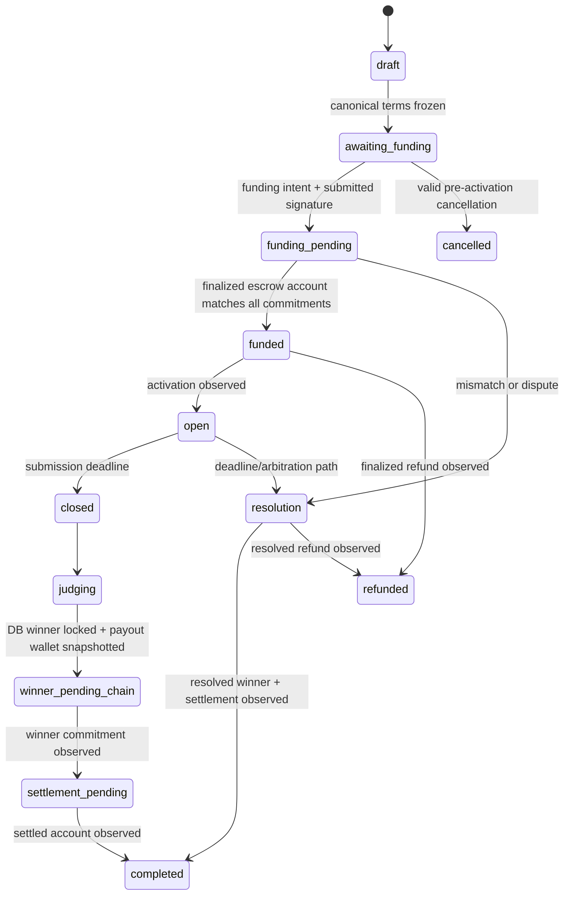

# V1 Bounty backend state machine

PostgreSQL owns workflow intent; Solana owns financial truth. API writes never make a Bounty funded, paid, or refunded by assertion alone.

| Solana escrow state | Required commitment checks                                  | PostgreSQL projection              |
| ------------------- | ----------------------------------------------------------- | ---------------------------------- |
| account absent      | expected PDA derived from UUID; no funding claim            | `awaiting_funding` / `not_created` |
| Initialized         | program owner, PDA, bounty ID, terms hash, mint, prize, fee | `funding_pending` at most          |
| Funded              | all commitments plus exact total deposit                    | `funded`                           |
| Active              | all commitments                                             | `open`                             |
| WinnerSelected      | designated winner equals verified payout snapshot           | `settlement_pending`               |
| Settled             | terminal state and winner match                             | `completed`, payout confirmed      |
| Refunded            | terminal refund state                                       | `refunded`                         |
| Resolution          | arbitration state                                           | `resolution`                       |

Any address, UUID-derived ID, terms, mint, amount, fee, winner, owner, or state mismatch records reconciliation evidence, moves escrow metadata to error, and opens a resolution record. Duplicate chain events are ignored by a unique chain/signature/event-index key. Scheduled reconciliation is the recovery path for missed webhooks and restarts.

The current worker observes and reconciles accounts. Transaction preparation, judge winner commitment, relayer settlement, and arbitration/refund execution are not implemented in the backend, so related API responses explicitly say that a chain action is required.
