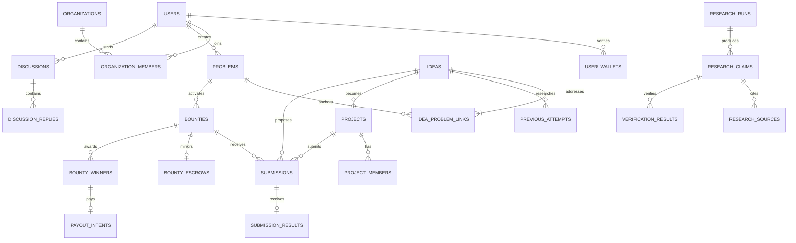

# Gimme Idea V1 — ERD and invariant review

## Invariant review

- Problem and Idea are separate; `idea_problem_links` enforces at most one primary link and publish logic enforces exactly one.
- Project references one originating Idea in V1.
- Submission and Project remain separate; Submission Result never writes Project Outcome.
- Bounty is optional and always references a Problem.
- Bounty escrow and payout confirmation are separate records; Solana will remain authoritative when enabled.
- Previous Attempt is queryable relational data but remains subordinate to Idea in product semantics.
- Discussion references canonical content without modifying it.
- Research claims, sources, verification and field provenance are versioned separately from creator thesis.
- Imported entities preserve source and duplicate candidates require controlled review.
